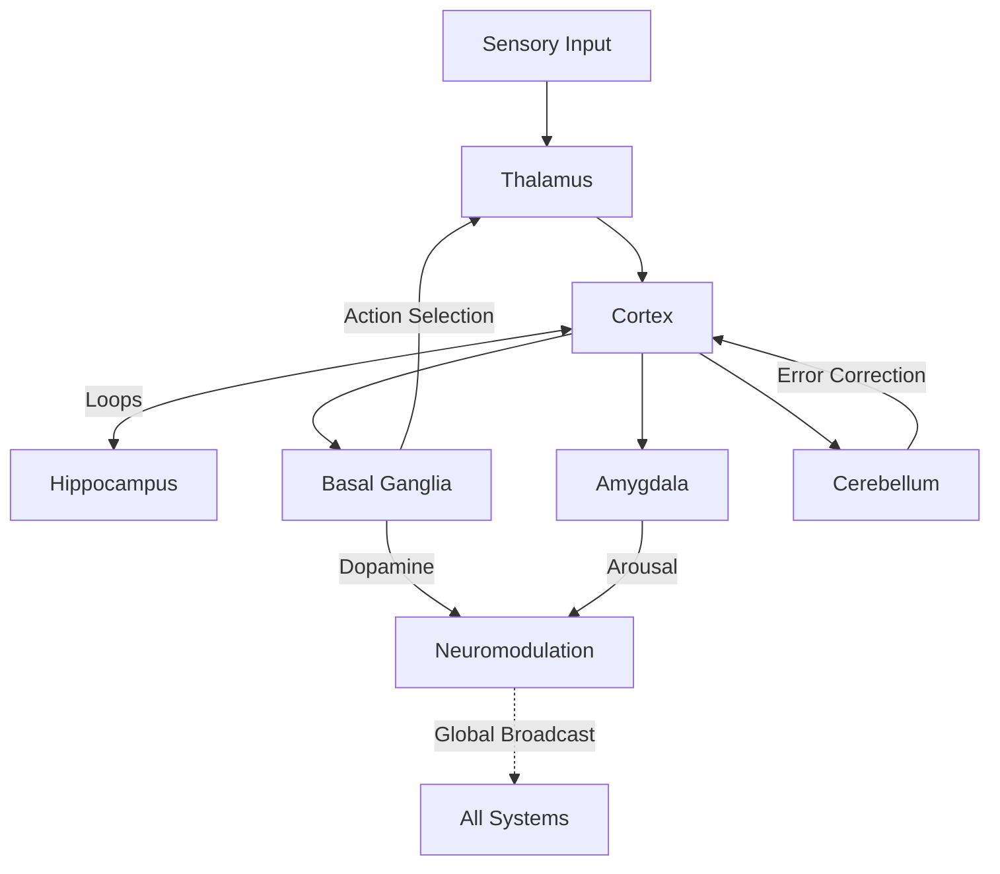

# System Architecture

The architecture of NeuroxAI mimics the macro-scale connectivity of the mammalian brain. The simulation runs in discrete timesteps (default `dt = 0.1ms`) to capture the fine temporal resolution of action potentials.

## Core Loop (`update` cycle)

The central update loop ensures proper causality and data flow between subsystems.

1.  **Sensory Processing (Bottom-Up)**
    *   **V1 (Visual Cortex)**: Processes raw visual input via Gabor filters (orientation selectivity). Accelerated by CUDA.
    *   **Cochlea**: Converts audio streams into spike trains via frequency decomposition.
    *   **Somatosensory**: Barrel cortex processes tactile input from the spatial system.

2.  **Thalamic Integration**
    *   The **Thalamus** receives these sensory inputs and acts as a gateway.
    *   It is modulated by **Attention** (Top-Down) and **Cortical Feedback**. Only salient information is relayed to the cortex.

3.  **Cortical Processing (Predictive Hierarchy)**
    *   Information flows up the hierarchy: `V1 -> V2 -> V4 -> IT -> PFC`.
    *   Simultaneously, predictions flow down. The difference (Prediction Error) drives learning and attention.
    *   **Working Memory** maintains active patterns via recurrent excitation, gated by Acetylcholine.

4.  **Subcortical Loops**
    *   **Hippocampus**: Receives high-level cortical patterns. Rapidly encodes "snapshots" of the state (Episodic Memory).
    *   **Amygdala**: Monitors sensory streams for threat/salience. Modulates global arousal (Norepinephrine) if threats are detected.
    *   **Basal Ganglia**: Receives state context. Selects the most valuable Action via Dopamine-modulated Go/NoGo pathways.
    *   **Cerebellum**: Computes motor errors and fine-tunes motor commands before execution.

5.  **Learning & Plasticity**
    *   **STDP**: Synaptic weights are updated based on the relative timing of pre- and post-synaptic spikes.
    *   **Homeostasis**: Neurons adjust their excitability to maintain a target firing rate (~5Hz).
    *   **Sleep**: When the system enters "sleep mode", the Hippocampus replays memories. These are consolidated into the cortex, and synaptic scaling normalizes weights.

## Data Flow Diagram

## GPU Acceleration Strategy

To achieve real-time performance with millions of neurons, NeuroxAI employs a hybrid CPU-GPU strategy:

*   **CPU (Rust/Rayon)**: Handles complex logic, sparse connectivity updates, and sequential decision making (Basal Ganglia, High-level Cognition).
*   **GPU (CUDA)**: Handles massive parallel operations:
    *   **Dense Convolution**: V1 visual processing (Gabor filters).
    *   **Motion Processing**: Optical flow computation (MT/MST).
    *   **Cognitive Kernels**: Large-scale attention matrix multiplication.

Data transfer between Host and Device is minimized by batching inputs and keeping sensory state resident on the GPU where possible.
